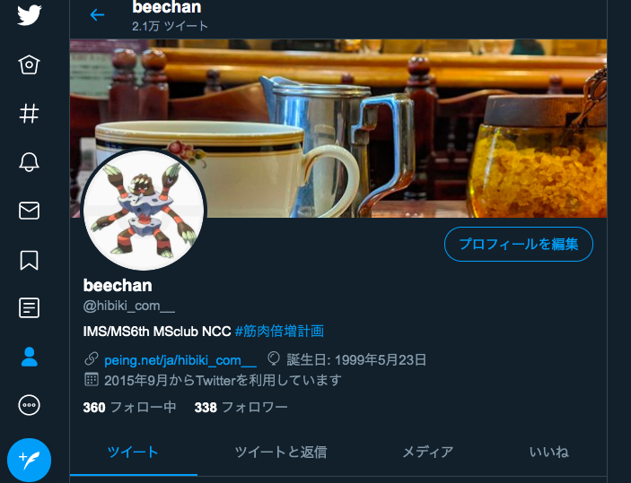

# @size[0.6em](サポートデスク in MS)

Jabelic(`@jabelic_`)/beechan(`@hibiki_com__`)

at : https://gitpitch.com/jabelic/ms-nclt-online#/

---
### 自己紹介

@snap[north-west span-35]
@box[bg-green text-white rounded box-padding](Status#IMS/MS B3 gndr研/ogw研 )
@snapend

@snap[north-east span-35]
@box[bg-orange text-white rounded box-padding](趣味#睡眠とぷよぐやみんぐとストレッチ)
@snapend

@snap[south-east span-35]
@box[bg-pink text-white rounded box-padding](特徴#スマホを首からぶら下げている)
@snapend

@snap[south-west span-35]
@box[bg-blue text-white rounded box-padding](Twitter#`@hibiki_com__` `@Jabelic_`)
@snapend

@snap[midpoint]
@snapend

---
### お品書き

- 本題
	- 概要
	- Slackとは
	- Scrapboxとは
	- 質問例
- 作成中の資料を紹介

 

---
### 本題

サポートデスク in MS

---

数学とかコンピュータを勉強するサークルを立ち上げようと思って作った_数理科学クラブ中野_

---

勉強って基本一人でするもんなんで、サークル作ったはいいが、特に何も起こることなく今の今まで特に目立った活動なしw

---

ということで、これを活用しようと今年度から始まった試み、**MS Slackコミュニティ** 

---
### 概要

MS Slackコミュニティ「数理科学クラブ中野」

---

@snap[west span-45 text-center]
MS Slackコミュニティ **数理科学クラブ中野**
@snapend

@snap[east span-55 text-center]
@ul[list-spaced-bullets list-fade-fragments]
- Slack & Scrapbox
- MSのサポートデスク
- 悩みやトラブルを共有しよう！
	- (1人の疑問はみんなの疑問。だいたいみんな同じことを考えている。)
@ulend
@snapend

---

### Slackとは

- コミュニケーションツール
- ワークスペース
	- 話題別にチャンネルを作る(#statistics, #general, #troubleshooting, #clang)

参考：[Slackって何？](https://slack.com/intl/ja-jp/help/articles/115004071768-Slack-%E3%81%A3%E3%81%A6%E4%BD%95%EF%BC%9F-)

---

### Scrapboxとは

- 共有Wiki
- 共同編集ができるのが強み
- ネットワーク型のメモ(階層がない)

参考：[第1話 Scrapboxってなあに？](https://scrapbox.io/wakaba-manga/%E7%AC%AC1%E8%A9%B1_Scrapbox%E3%81%A3%E3%81%A6%E3%81%AA%E3%81%82%E3%81%AB%EF%BC%9F)

---

- [Slackはこちらから](https://join.slack.com/t/ms-club-nakano/shared_invite/zt-dyrf2pep-krKcSsedq3XBmF~gb7rBVQ)

- [Scrapbox招待URL(踏めば編集権限が渡ります。)](https://scrapbox.io/projects/ms-club-nakano/invitations/5f5b9976a7c7e90cda379a93a3019f22)
	- 「新しく入った人へ」を参照してください。

---

### 例

@snap[north-west span-35]
@box[bg-blue text-white rounded box-padding](randam#「この本めっちゃよかったので読め」)
@snapend

@snap[north-east span-35]
@box[bg-blue text-white rounded box-padding](randam#「低気圧くそ」)
@snapend

@snap[south-east span-35]
@box[bg-blue text-white rounded box-padding](calculate#「3行目と4行目の式変形がわかりません。」<Gyazoの写真を貼る>)
@snapend

@snap[south-west span-35]
@box[bg-blue text-white rounded box-padding](clang#プログラムの質問等<ソースコードぺたっ。>)
@snapend

---

 
[質問は恥ではないし役に立つ](https://qiita.com/seki_uk/items/4001423b3cd3db0dada7)
- 正直こんなに色々書かなくていいと思うけど(所属とか)、必要な情報を書こうね、というお話。
 

---

まあなんか役に立てばいいと思っています。

おもしろかった技術記事とか共有するも良し（よくやる）。

---

### 作成中の資料を紹介

新入生に向けて。

---

- [MacBookAir/Cプログラム　入門](https://hackmd.io/@Jabelic/ry4LtABu8)(制作途中。全然書いてない。)
- [初めてのパーソナルコンピューター](https://hackmd.io/@Jabelic/rJkpsW1wU)
- [初めての大学生活](https://hackmd.io/@Jabelic/B13oLy5UL)
- [LaTeXテキスト for Freshman](https://hackmd.io/@Jabelic/rJ4uZjKUL)

---

リクエストがあれば、[beechan](https://twitter.com/hibiki_com__)まで

ログインすれば編集できるので、割り込み書き込み修正歓迎です。

---

`MS_NCLT`